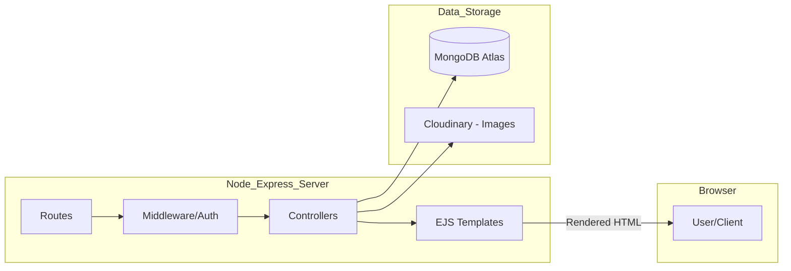

🏠 StayNest

StayNest is a mini clone of Airbnb — a full-stack web application where users can browse, book, and list properties for short-term stays.
Built using Node.js, Express.js, MongoDB, and EJS.

## Output Demo: 

https://github.com/user-attachments/assets/71f1c8a0-1a79-465e-bb10-8533bdbad419

## 🚧 Project Status

This project is now finished. 🎉

⚡ Note: This project was built as part of the Apna College Delta Web Development Course. The main goal was to practice full-stack development concepts. I extended/customized some parts to improve my learning.
 
## ✨ Features

🧑 User registration & login

🏘 View all property listings

📝 Create, update, and delete listings (CRUD)

📸 Upload property images (via Multer)

🔒 Authentication & session management (via Passport.js)

## 🛠 Tech Stack

### Frontend

### Backend

### Database & Storage

## 

[🏠 StayNest.pdf](https://github.com/user-attachments/files/25937014/StayNest.pdf)

## 🏗️ System Architecture

## 📦 Installation & Setup

1️⃣ Clone the repository

git clone https://github.com/jayalloyd/staynest.git
cd staynest

2️⃣ Install dependencies

npm install

3️⃣ Setup environment variables
Create a .env file in the root directory and add the following:

🔑 Environment Variables

To run this project, you will need to add the following variables to your `.env` file:

`CLOUD_NAME`, `CLOUD_API_KEY`, `CLOUD_API_SECRET` (Cloudinary)  
`DB_URL` (MongoDB Connection string)  
`SECRET` (For express-session)

MONGO_URI=your_mongo_connection_string
SESSION_SECRET=your_secret_key
PORT=8080

4️⃣ Run the application

nodemon app.js

5️⃣ Visit in browser

http://localhost:8080/listings
